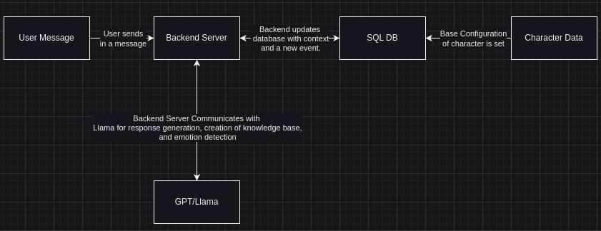

# Character Neural Engine
Some bleeding edge Machine Learning technologies (Llama 2, GPT3.5/4)
directly in gameplay.

Is no longer the current neural engine due to a new engine, and is deprecated/archived.

## Introduction
The backend process (What happens in the back):

1. The server recieves a user message. I.e ("Hello, bob!")

2. The server looks to see if user exists, and loads its "baked", 
base data, that all conversations will build off of.

3. The server then looks into the database, to see if there are addition
context it needs. For example, previous user messages, new events that happened,
etc. If there are any, it loads them in as well.

4. The server generates the characters knowledge-set based off of the past events.
For example, if there were three events, "Bob found tree by rock", "Bob found tree
by other rock", "Bob found tree by another rock", then it will add something
along the lines of "Bob thinks/knows (can vary) that trees are by rocks". It checks
the entire event, partially to save both cost (model runtime performance), and to
merge conflicting events correctly. 

5. The server then loads the context of previous messages, if any, into a format
that Llama can understand.

6. The server then processes the entire prompt, engineering it in this format:

`Transcript of a dialog, where {name} interacts with {familiarity}. {name} is {personality}, and knows {knowledgebase}. {context} {familiarity}: {message} | {name}:"`. 

7. The prompt is sent to a LLM and gets a response. Using the response it gets, it reruns the response into an emotions detector, also powered by a LLM, and filters out useful emotions
that change state.

8. Finally, it formats up both of them and returns them both.

## Self Deployments
To run from the server, there are scripts provided to run. 
Linux and MacOS users use the serve.sh, and Window users use the serve.bat.

For the backend, create a .env file with the data, source it, and then
use OpenAIs API (given you have a key and token). If not, deploy the 
llama.cpp server from [their repository](https://github.com/ggerganov/llama.cpp)

Open AI Usage: `./scripts/serve.sh $KEY $ORG`

LLama Server Usage: `./scripts/serve.sh $LLAMA_SERVER`

## Basic API

To integrate with the server with an app, first send a GET to https://{url-of-backend}/genkey/
This returns a JSON response with 2 paramaters, a key and a session token.
The key is for tracking context of the model, and the session token is to prevent others from corrupting
other's context sessions. Once you have the tokens, send a POST to https://{url-of-backend}/ask/ with 
the following JSON data:

`character | string`

`message | string`

`chatID (the key) | number`

`session | string`

Then, you will recieve a JSON response with the following:

`response | string`

`emotion | [string1, string2, string3...]`

Now, you have a working interaction between the Character Neural Engine and your frontend!

# Limitations
The model response accuracy may be questionable at times. While between characters,
it talks pretty distiguisable, sometimes, it just straight up does a bad job, leaves it empty,
etc.

The emotions portion of the AI engine is extremely inaccurate, due to a feed through to 
Llama instead of a dedicated AI. I expect this to be patched with the newer model that uses actions instead of some context crap.

# License
This repository is licensed the MIT License.

# Development
The project uses a FastAPI python backend, managed with Poetry.
It is compatible with llama.cpp server, and is compatible with 
OpenAI's GPT3.5 and GPT4.

# Performance
Performance is okay. Not horrible for short contexts, but as a whole character, is really bad.

## Hardware Performance

The inference server runs fairly well with INT4 models on midrange hardware. For reference,
there is a ~26s inference time on a AMD Ryzen 5800H.

All of the below is at n_threads = physical cores. Time per response are a 3 sample average.

|CPU |Model  | Time per Response|
--- | --- | ---|
|AMD Ryzen 7 5800H | Llama v2 13B | 30.169s|
|Xeon E5 2670 (4 Core VM)| Llama v2 13B | 89.36s|
|AMD Ryzen 7 5800H + 4 layers to NVIDIA RTX 3050 Ti | Llama v2 13B | 18.864s|
|Intel i7 13700K + 15 layers to NVIDIA RTX 4070 | Llama v2 13B |2.171s |

## Future Optimizations
Will be replaced by a action/past event based model, one that I am currently working on.
